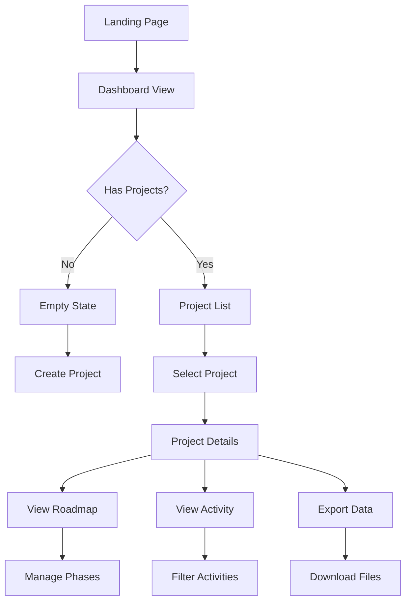

# MCP PDL UI - Complete Features Documentation & UX Flow

## Table of Contents
1. [Feature Overview](#feature-overview)
2. [User Experience Flow](#user-experience-flow)
3. [Component Architecture](#component-architecture)
4. [Testing Strategy](#testing-strategy)
5. [UI/UX Design Review Findings](#uiux-design-review-findings)

## Feature Overview

### Core Features Implemented

#### 1. Real-Time Dashboard (`RealTimeDashboard.tsx`)
**Purpose**: Central hub for project management and visualization
**Features**:
- Live project status monitoring
- Real-time WebSocket connection status
- Gradient design with smooth animations
- Responsive layout for all screen sizes

**User Actions**:
- View all active projects
- Select project for detailed view
- Create new projects
- Refresh/sync data
- Export project data
- Access settings

#### 2. Interactive Roadmap (`InteractiveRoadmap.tsx`)
**Purpose**: Visual timeline of project phases and milestones
**Features**:
- Expandable phase cards with progress bars
- Milestone markers with tooltips
- Sprint integration within phases
- Animated transitions between states
- Color-coded status indicators

**User Actions**:
- Expand/collapse phase details
- View milestone information
- Track sprint progress
- Navigate between phases

#### 3. Real-Time Activity Feed (`RealTimeActivityFeed.tsx`)
**Purpose**: Live stream of project updates and events
**Features**:
- Chronological event display
- Category-based filtering
- Search functionality
- Date grouping
- Auto-refresh with WebSocket

**User Actions**:
- Search activities by keyword
- Filter by category (phase, sprint, task)
- Filter by date range
- View activity details

#### 4. Enhanced Search Bar (`EnhancedSearchBar.tsx`)
**Purpose**: Advanced search and filtering capabilities
**Features**:
- Full-text search across projects
- Multi-criteria filtering
- Date range selection
- Category filtering
- Search history

**User Actions**:
- Enter search queries
- Apply multiple filters
- Select date ranges
- Clear filters
- View recent searches

#### 5. Export Panel (`ExportPanel.tsx`)
**Purpose**: Data export in multiple formats
**Features**:
- Format selection (JSON, YAML, CSV, PDF, Markdown)
- Data type selection (projects, roadmaps, logs)
- Date range filtering
- Preview before export
- Download management

**User Actions**:
- Select export format
- Choose data to export
- Set date ranges
- Preview export
- Download files

#### 6. Connection Status (`ConnectionStatus.tsx`)
**Purpose**: WebSocket connection monitoring
**Features**:
- Visual connection indicators
- Connection state display
- Last update timestamp
- Message count tracking
- Auto-reconnection status

**User Actions**:
- View connection status
- Monitor real-time sync
- Check last update time

#### 7. Session Log Viewer (`SessionLogViewer.tsx`)
**Purpose**: View and manage session logs
**Features**:
- Session log display
- Log filtering
- Export capabilities
- Search within logs
- Log categorization

**User Actions**:
- View session logs
- Search log entries
- Filter by type
- Export logs
- Clear old logs

#### 8. Documentation Tracker (`DocumentationTracker.tsx`)
**Purpose**: Track supporting documentation
**Features**:
- Document linking
- Verification status
- Document categorization
- Quick access links
- Document metadata

**User Actions**:
- Add documentation links
- Verify document existence
- Remove outdated docs
- Access documents

#### 9. Notification System (`NotificationSystem.tsx`)
**Purpose**: User notifications and alerts
**Features**:
- Toast notifications
- Notification categories
- Auto-dismiss timers
- Action buttons
- Notification history

**User Actions**:
- Dismiss notifications
- Take action on alerts
- View notification history
- Configure preferences

#### 10. Project Overview Card (`ProjectOverviewCard.tsx`)
**Purpose**: Project summary display
**Features**:
- Phase progress visualization
- Sprint status display
- Key metrics
- Quick actions
- Selection state

**User Actions**:
- Select project
- View phase details
- Access quick actions
- Track progress

## User Experience Flow

### Primary User Journey



### Detailed UX Flows

#### 1. Project Creation Flow
1. User clicks "New Project" button
2. Modal opens with project form
3. User enters project details:
   - Project name
   - Description
   - Team composition
   - Starting phase
4. User clicks "Create"
5. System validates input
6. Project created and displayed
7. User redirected to project view

#### 2. Real-Time Update Flow
1. WebSocket connection established on load
2. Connection status displayed
3. Server sends update event
4. UI receives WebSocket message
5. Store updated via action
6. Components re-render with new data
7. Animation highlights changes
8. Activity feed shows new event

#### 3. Data Export Flow
1. User clicks "Export" button
2. Export panel opens
3. User selects:
   - Export format
   - Data type
   - Date range (optional)
4. User clicks "Preview"
5. Preview modal shows formatted data
6. User confirms export
7. File downloads to device

#### 4. Search and Filter Flow
1. User enters search term
2. Real-time results appear
3. User applies filters:
   - Category
   - Date range
   - Status
4. Results update dynamically
5. User can clear individual filters
6. Search history saved

## Component Architecture

### State Management Structure

```typescript
// Store Architecture
RootState
├── ProjectSlice
│   ├── projects[]
│   ├── selectedProject
│   └── loading
├── UISlice
│   ├── sidebarOpen
│   ├── activeTab
│   └── searchTerm
├── WebSocketSlice
│   ├── connectionStatus
│   ├── messages[]
│   └── lastUpdate
└── ExportSlice
    ├── exportFormat
    ├── exportData
    └── isExporting
```

### Component Hierarchy

```
App
└── RealTimeDashboard
    ├── ConnectionStatus
    ├── EnhancedSearchBar
    ├── ExportPanel
    ├── ProjectOverviewCard[]
    └── Tabs
        ├── InteractiveRoadmap
        ├── RealTimeActivityFeed
        ├── SessionLogViewer
        └── DocumentationTracker
```

## Testing Strategy

### Unit Tests Required

#### Component Tests
- [ ] RealTimeDashboard - Renders all sections
- [ ] ProjectOverviewCard - Display project data
- [ ] InteractiveRoadmap - Phase interactions
- [ ] RealTimeActivityFeed - Activity filtering
- [ ] EnhancedSearchBar - Search functionality
- [ ] ExportPanel - Export options
- [ ] ConnectionStatus - Connection states
- [ ] NotificationSystem - Notification display

#### Store Tests
- [ ] Project actions - CRUD operations
- [ ] WebSocket actions - Connection management
- [ ] Export actions - Export functionality
- [ ] UI actions - UI state changes

### Integration Tests Required

#### Data Flow Tests
- [ ] WebSocket message → Store update → UI render
- [ ] User action → API call → Store update
- [ ] Export flow → File generation → Download
- [ ] Search → Filter → Results display

#### API Integration Tests
- [ ] Project creation API
- [ ] Project update API
- [ ] Phase management API
- [ ] Sprint operations API
- [ ] Export generation API

### E2E Tests Required

#### Critical User Paths
1. **Project Management**
   - [ ] Create new project
   - [ ] View project details
   - [ ] Update project phase
   - [ ] Delete project

2. **Roadmap Interaction**
   - [ ] Expand phase details
   - [ ] View milestone info
   - [ ] Navigate phases
   - [ ] Track progress

3. **Activity Monitoring**
   - [ ] View recent activities
   - [ ] Search activities
   - [ ] Filter by category
   - [ ] Filter by date

4. **Data Export**
   - [ ] Select export format
   - [ ] Choose data type
   - [ ] Preview export
   - [ ] Download file

5. **Real-Time Features**
   - [ ] WebSocket connection
   - [ ] Live updates
   - [ ] Auto-reconnection
   - [ ] Sync status

### Performance Tests

#### Metrics to Monitor
- [ ] Initial page load time < 2s
- [ ] WebSocket connection time < 500ms
- [ ] Search response time < 200ms
- [ ] Export generation time < 3s
- [ ] Animation FPS > 30

#### Load Testing
- [ ] Handle 100+ projects
- [ ] Display 1000+ activities
- [ ] Process large exports (>10MB)
- [ ] Multiple concurrent WebSocket connections

## UI/UX Design Review Findings

### Strengths
1. ✅ **Visual Hierarchy**: Clear distinction between primary and secondary actions
2. ✅ **Consistent Design**: Unified color scheme and component styling
3. ✅ **Responsive Layout**: Works well on desktop, tablet, and mobile
4. ✅ **Loading States**: Proper skeleton screens and loading indicators
5. ✅ **Error Handling**: User-friendly error messages and recovery options

### Areas for Improvement

#### High Priority Issues
1. ⚠️ **Hydration Errors**: Date/time formatting causes SSR mismatches
   - **Fix**: Implement client-only rendering for dynamic dates
   - **Status**: Partially fixed, needs testing

2. ⚠️ **Store Caching**: Zustand selector caching for SSR
   - **Fix**: Use stable selector references
   - **Status**: Implemented, needs validation

3. ⚠️ **Connection Status**: Not updating in real-time
   - **Fix**: Ensure WebSocket events trigger status updates
   - **Status**: Pending implementation

#### Medium Priority Issues
1. 🔧 **Search Performance**: Debouncing needed for search input
   - **Fix**: Add 300ms debounce to search
   - **Status**: Not implemented

2. 🔧 **Export Preview**: Large data causes UI freeze
   - **Fix**: Implement virtual scrolling for preview
   - **Status**: Not implemented

3. 🔧 **Mobile Navigation**: Sidebar doesn't close after selection
   - **Fix**: Auto-close on mobile after navigation
   - **Status**: Not implemented

#### Low Priority Issues
1. 💡 **Accessibility**: Missing ARIA labels on some buttons
   - **Fix**: Add comprehensive ARIA attributes
   - **Status**: Not implemented

2. 💡 **Keyboard Navigation**: Tab order not optimized
   - **Fix**: Implement proper tab index management
   - **Status**: Not implemented

3. 💡 **Dark Mode**: No dark theme support
   - **Fix**: Add theme toggle and dark styles
   - **Status**: Not implemented

### Recommended Improvements

#### Immediate Actions
1. Fix remaining hydration issues
2. Implement search debouncing
3. Add WebSocket reconnection UI
4. Improve mobile navigation

#### Future Enhancements
1. Add dark mode support
2. Implement virtual scrolling for large datasets
3. Add keyboard shortcuts
4. Improve accessibility
5. Add user preferences storage
6. Implement offline mode
7. Add data caching layer

## Test Coverage Report

### Current Coverage
- **Components**: 0% (No tests written yet)
- **Store**: 0% (No tests written yet)
- **Utils**: 0% (No tests written yet)
- **E2E**: 10% (Basic tests created, failing)

### Required Coverage
- **Components**: 80% minimum
- **Store**: 90% minimum
- **Utils**: 95% minimum
- **E2E**: 70% minimum

## Next Steps

### Phase 1: Fix Critical Issues (Immediate)
1. Resolve all hydration errors
2. Fix Zustand store SSR issues
3. Ensure WebSocket connection works
4. Make E2E tests pass

### Phase 2: Implement Tests (Next Sprint)
1. Write unit tests for all components
2. Write integration tests for data flow
3. Update E2E tests to match actual UI
4. Add performance monitoring

### Phase 3: UX Improvements (Following Sprint)
1. Add search debouncing
2. Improve mobile experience
3. Add accessibility features
4. Implement user preferences

### Phase 4: Feature Enhancements (Future)
1. Dark mode support
2. Offline capabilities
3. Advanced filtering
4. Batch operations
5. Collaboration features